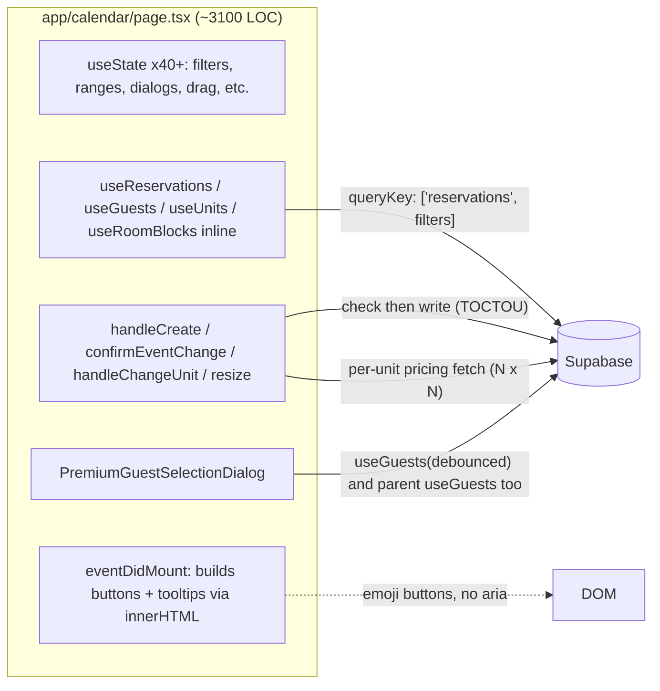

# Senior Review of Calendar Reservations — Enhancement Plan

## What I reviewed

- `[app/calendar/page.tsx](app/calendar/page.tsx)` — single ~3,100-line client component owning the page, FullCalendar, drag/drop/resize, create flow, dialogs, tooltips, and the embedded `PremiumGuestSelectionDialog`.
- `[lib/hooks/use-reservations.ts](lib/hooks/use-reservations.ts)`, `[lib/hooks/use-guests.ts](lib/hooks/use-guests.ts)`, `[lib/hooks/use-units.ts](lib/hooks/use-units.ts)`.
- `[app/calendar/calendar-styles.css](app/calendar/calendar-styles.css)`.
- `[components/forms/GuestForm.tsx](components/forms/GuestForm.tsx)` (only as it intersects the calendar's create-guest flow).

## Architecture today (and where it leaks)

Three structural problems flow from this shape: (1) the page mixes data access, business rules, presentation, imperative DOM, and a sub-feature dialog in one file; (2) mutating handlers do their own ad-hoc Supabase work instead of going through a single domain layer, so guarantees diverge between code paths; (3) a global `calendarDataLoading` ANDs every query into one flag, so the slowest unrelated query (audit logs / admin users) blocks first paint.

## Findings, by category

Each item is tagged with a severity I'd give in a real PR review: **P0** correctness/security, **P1** real bug or significant UX, **P2** quality/perf, **P3** polish.

### A. Correctness & data integrity

- **P0 — same-unit drag and resize skip conflict checks.** `confirmEventChange` only queries `reservations` when `unitChanged` is true (`[app/calendar/page.tsx](app/calendar/page.tsx)` ~~1046–1115); the resize branch (~~1133–1152) goes straight to `updateReservation.mutateAsync`. Users can move/resize on top of an existing booking on the same unit and the UI says "success" until/unless the DB rejects it.
- **P0 — `handleCreateReservation` has no pre-flight overlap or block check** (~880–938). It loops units and calls `createReservation.mutateAsync` per unit, trusting whatever is in cache and DB.
- **P0 — all checks are TOCTOU.** Read-then-write across two HTTP calls; two browsers can pass the same check. There is no DB exclusion constraint backing this up (no `tstzrange &&` GiST). Required: either a single Postgres function (RPC) that locks and checks, or a `EXCLUDE USING gist` constraint on `(unit_id WITH =, daterange(check_in_date, check_out_date) WITH &&)` for active statuses.
- **P1 — multi-unit create is not transactional.** The for-loop in `handleCreateReservation` may succeed on N-1 units and fail on the last; no rollback, no "all or nothing" toast.
- **P1 — maintenance units are still pickable in the guest dialog.** The timeline `selectAllow` blocks them, but the dialog's checkbox list iterates raw `units` without filtering `status === 'maintenance'`, and `handleCreateReservation` does not re-validate.
- **P1 — stale `selectedUnitIds` when the dialog reopens with empty `initialUnitId`.** `useEffect(() => { if (initialUnitId) setSelectedUnitIds([initialUnitId]) }, [initialUnitId])` (~2771) leaves the previous selection intact when there is no preset unit.
- **P2 — `dateFrom`/`dateTo` filter semantics on `useReservations` are "fully contained," not overlap.** Reservations spanning the boundary disappear from the reservations page filter. Calendar uses overlap (just fixed); the legacy semantics on `dateFrom/dateTo` are still misleading callers.

### B. Permissions & security

- **P0 — inline gating is inconsistent.** Restricted BranchManager loses the delete button (~1888–1900) but keeps change-unit and drag/resize. `editable={true}` and `selectable={true}` are unconditional. If RLS isn't tight, this is a real hole. If RLS is tight, it's only UX confusion — but we shouldn't rely on confusion.
- **P1 — `audit_logs` write only on the BM booking-notification path** (~940–952). Other roles have no client-side audit; if relying on DB triggers, fine — needs an explicit confirmation comment, otherwise we have a gap.

### C. Performance

- **P1 — `calendarDataLoading` AND of every query** (~1263–1268) blocks the skeleton on `audit-logs-reservation-creators` and `auth-users-for-calendar`, which are heavy and unrelated to first paint.
- **P1 — N pricing round-trips in `handleCreateReservation`** (~880–898). Should be one batched `pricing` query (`.in('unit_id', unitIds)`) or a Supabase RPC.
- **P2 — duplicate `useGuests`** in parent (line 310) and `PremiumGuestSelectionDialog` (~2784). The parent's call is a 100-row preview that nothing in the page actually needs and it gates the skeleton.
- **P2 — `room_blocks` fetched globally** (~345–366) with no location/window filter. Will scale poorly.
- **P2 — the file ships ~3,100 LOC of client JS.** Splitting + memoization makes a real difference on cold loads.
- **P3 — manual `queryClient.invalidateQueries({ queryKey: ['reservations'] })` in `handleChangeUnit`** (~1239) duplicates what `useUpdateReservation` already does (`use-reservations.ts` ~252–254).
- **P3 — `useCreateGuest` / `useUpdateGuest` call both `invalidateQueries` and `refetchQueries`** (`[lib/hooks/use-guests.ts](lib/hooks/use-guests.ts)` ~87–89, ~109–112). The refetch is redundant.

### D. State & hydration

- **P1 — `useState(() => localStorage.getItem(...))` for `rangeStart`, `rangeEnd`, `calendarDirection`, `selectedTypes`, etc.** Reads `window` during initialization. The current guard is `typeof window !== 'undefined'`, which works for client components but produces inconsistent first-render values when the component is mounted in a way that hydrates with a default. Safer pattern: initialize to a deterministic default and read localStorage in `useEffect` after mount, or use `useSyncExternalStore`.
- **P2 — overlapping loading flags.** `unitsLoading`, `reservationsLoading`, `guestsLoading`, `currentStaffLoading`, `roomBlocksLoading` plus derived `staffProfileLoading` and `calendarDataLoading`. Easy to break and adds re-renders.
- **P3 — `console.log('Calendar filters changed:', …)`** (~~640) and `console.log('Pricing Calculation:', …)` (~~916) — both can leak PII to devtools.

### E. UX / accessibility

- **P1 — arrow-key range shift is hard-coded RTL** (~727–732). When `calendarDirection === 'ltr'` the keys go the wrong way.
- **P1 — inline event buttons are emoji + `title` only** (delete/change-unit/open-tab around ~1893–2030). No `aria-label`, no `type="button"`, no keyboard focus order, no RTL-aware positioning.
- **P1 — guest rows are clickable `motion.div`s** (~2956–2974). No `role="button"`, no `onKeyDown`, no focus ring — keyboard users cannot select.
- **P2 — confirm button not disabled while mutation is pending.** Double-clicks can fire duplicate updates.
- **P2 — double success toast** when creating a guest from the dialog (`GuestForm` toasts; the dialog also toasts after a 500 ms delay).
- **P3 — dead props/state.** `newGuestCreated` is `setNewGuestCreated`'d nowhere meaningful and never read by the dialog; `onCreateGuest` is passed in but unused.
- **P3 — tooltips clean up via `MutationObserver` on `document.body` when `parentNode` is missing** (~2169). Works, but a `eventWillUnmount` callback is cheaper and more accurate.

### F. Code quality

- **P2 — types**: `blockToDelete: any` (~~184), `pendingEventChange: { ..., info: any }` (~~187), dialog props `guests: any[]`, `units: any[]` (~2755). Drop the `any`s.
- **P2 — duplicated availability logic** between `confirmEventChange` and `handleChangeUnit` builds string `.or(...)` filters and hand-rolls overlap math twice.
- **P2 — unused `getStatusGradient`** (~386–396).
- **P3 — CSS**: `width: 100% !important;` declared **twice** in `.fc-datagrid-body .fc-datagrid-cell-cushion` (~268–270). Pervasive `!important` is unavoidable around FullCalendar but should be consolidated.
- **P3 — `key={unitLink.unit?.id || Math.random()}`** (~2702) — guaranteed remount when id is missing.

## Enhancement roadmap (prioritized)

The roadmap below is a series of independently-shippable PRs in the order I would do them. Each todo lists the headline change and the files I expect to touch.

This plan is informational only — confirm and pick the slice you want before I switch to Agent mode and implement anything.